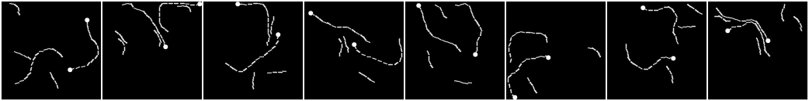
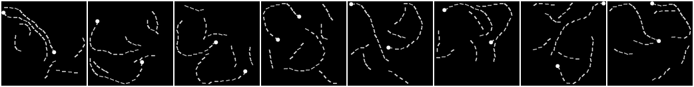
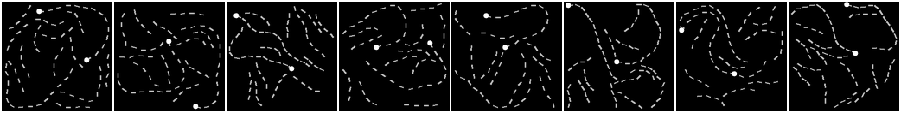
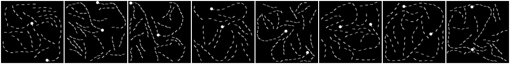
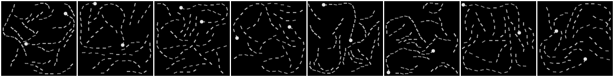

## Generating Pathfinder Datasets
Instruction on Generating Pathfinder Dataset in Increasing Complexity   

Clone pathfinder-generator  `git clone https://github.com/bhattarailab/pathfinder-generator.git` 
**From:** `./pathfinder-generator` - using the environment provided. 

1. Generate Pathfinder-128 with **no gap** between dashes/paddles. *We generate 200K samples with seed 123*.     
Run: `python LRA_pathfinder.py 1 0 200000 nogap 123 <optional output directory>`   
* *Here, LRA_pathfinder.py takes optional output directiory. The default directory is* `./generation` *. Please change it according to your preferences.* Follow `./pathfinder-generator/README.md` for details of arguments.

2. Generate Pathfinder-128 with **gap of 2** between dashes/paddles. This is equivalent to `alpha=0.0` *We generate 200K samples with seed 123*.   
Run: `python LRA_pathfinder.py 1 0 200000 0.0 123`

3. Generate Pathfinder-128 with increasing number of distractor snakes and gaps. Run the scripts for different `alpha = [0.75, 1.25]` *We generate 200K samples with seed 123*.   
Run: `python LRA_pathfinder.py 1 0 200000 <alpha> 123`

## Visualizing Pathfinder

**From:** `LRA/datasets/` *using python-3 environment provided in this repo*,  
Run: `python pathfinder_viz.py <data-directory> <number-of-images>`   
E.g.  `python pathfinder_viz.py ./pathfinder-generator/generation/cl14_nogap 10`   
This will create `pathX-cl14_nogap.png` file with `10` random images from the dataset in a single row.

This script can also be used for downloaded LRA pathfinder: (default directory) `./lra_release/lra_release/pathfinder128/curv_contour_length_14`

## Processing the Generated Dataset for DataLoader
The generated data should be processed to `*.pickle` file for use in the training script. Follow instruction below to process.

**From:** `LRA/datasets/`   
Run: `python pathfinder_gen.py <data-directory>`   
E.g.  `python pathfinder_gen.py ./pathfinder-generator/generation/cl14_nogap`   
This will create `pathX-cl14_nogap` dataset `pickle` with train, test and dev splits.

Use the script for all generations: `.../cl14_alpha0.0`, `.../cl14_alpha0.75`, `.../cl14_alpha1.25`.

## Example Data

| Dataset             |  Samples |
:-------------------------:|:-------------------------:
Pathfinder64_contour_length_14  |  
PathX_cl14_nogap  |  
PathX_cl14_alpha0.0  |  
PathX_cl14_alpha0.75  |  
PathX_cl14_alpha1.25  |  
PathX_contour_length_14  |  

